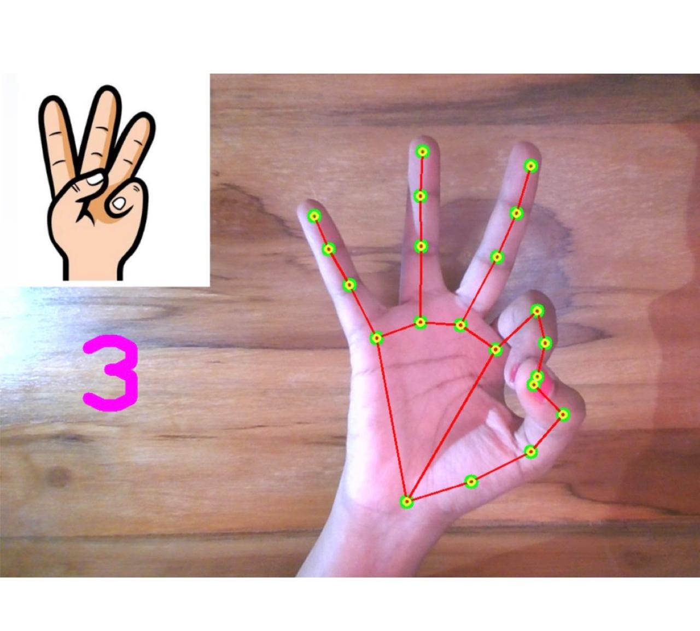

# Hand-Gesture-Counter

Hand Gesture Counter is designed to recognize and count the number of fingers held up by a user. The project uses OpenCV for image processing and MediaPipe for hand tracking and gesture recognition.
## Features
- Real-time hand detection and tracking
- Finger counting using hand landmarks
- Visual feedback with overlaid hand landmarks and finger count
## Project Working

